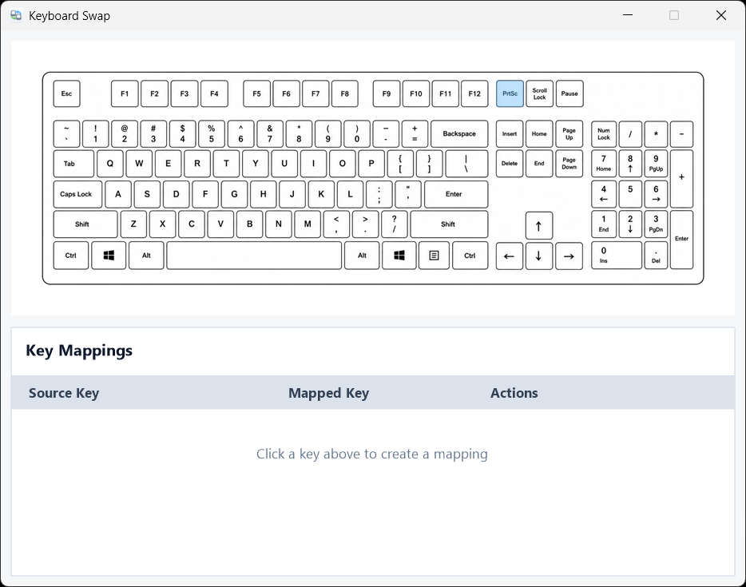

# Keyboard Swap

当前版本：`1.2.0`

Keyboard Swap 是一个 Windows 键盘映射工具，用于在图形界面中选择按键并配置按键替换规则。



## 使用说明

1. 下载 Release 中的 Windows x64 产物包。
2. 解压后运行 `KeyboardSwap.exe`。
3. 在窗口上方的键盘区域点击一个原按键，再点击目标按键，即可创建映射。
4. 在下方映射列表中可以编辑或删除已有映射。
5. 右键托盘图标可以启用或暂停按键映射、设置开机自启、切换语言。

配置会保存到程序所在目录的 `keymap.json`。

## 源码编译

编译环境：

- Windows
- Visual Studio 2026 或兼容版本
- MSVC `v145` 平台工具集
- Windows 10 SDK

使用 Visual Studio 编译：

1. 打开 `KeyboardSwap.sln`。
2. 选择 `Release` 和 `x64`。
3. 执行生成解决方案。

使用命令行编译：

```powershell
msbuild KeyboardSwap.sln /p:Configuration=Release /p:Platform=x64
```

生成完成后，可执行文件位于 `x64\Release\KeyboardSwap.exe`。
